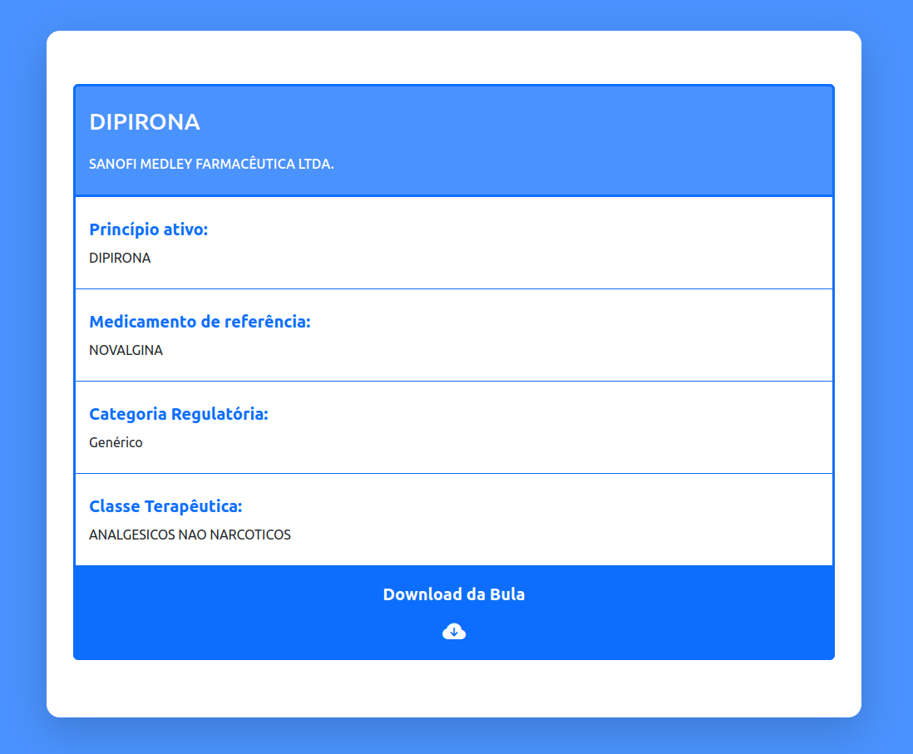

# MedicationSearch

## Sobre o Projeto

Uma aplicação front-end para a busca de medicamentos por nome na API da ANVISA,
visualizar detalhes específicos e baixar a bula do paciente.

## Layout

 <br>


## Tecnologias utilizadas

- JavaScript
- React
- react-router-dom
- Bootstrap
- PropTypes
- axios

## Como rodar o projeto

#### Pré-requisitos: npm

```bash
# Clone o repositório
git clone https://github.com/Gustavo-de-Brito/find-medication.git
```

```bash
# Entre na pasta do projeto
cd find-medication
```

```bash
# Instale as dependências necessárias
npm i
```

```bash
# Rode o projeto
npm run start
# a aplicação está disponível no endereço http://localhost:3000
```
